# ☁️ AWS Call Center Infrastructure Migration

---

# AWS Call Center Infrastructure Migration

## 📖 Overview

This project demonstrates the migration of an on-premises call center infrastructure to Amazon Web Services (AWS).

The objective of this migration was to modernize the existing infrastructure by leveraging AWS cloud services to improve scalability, high availability, security, monitoring, and backup management.

The environment hosts a call center platform based on **SuiteCRM** and **Issabel PBX**, deployed on Amazon EC2 and integrated with managed AWS services.

---

# 📑 Table of Contents

- Overview
- Project Objectives
- AWS Services Used
- Solution Architecture
- Infrastructure Components
- High Availability
- Security
- Monitoring
- Backup Strategy
- AWS Console Screenshots
- Future Improvements
- Lessons Learned
- Project Status
- Author

---

# 🎯 Project Objectives

The primary objectives of this project were to:

- Migrate an on-premises call center infrastructure to AWS
- Increase system availability through cloud infrastructure
- Improve scalability using Auto Scaling Groups
- Distribute traffic using an Application Load Balancer
- Secure cloud resources using IAM and Security Groups
- Implement centralized monitoring with Amazon CloudWatch
- Protect business data using Amazon S3 and AWS Backup
- Reduce infrastructure management complexity
- Follow AWS Well-Architected Framework best practices

---

# ☁️ AWS Services Used

| AWS Service | Purpose |
|-------------|---------|
| Amazon EC2 | Hosting SuiteCRM and Issabel PBX servers |
| Amazon VPC | Private cloud networking |
| Public Subnets | Internet-accessible infrastructure |
| Route Tables | Traffic routing |
| Internet Gateway | Internet connectivity |
| Security Groups | Firewall protection |
| Application Load Balancer | Load distribution |
| Auto Scaling Group | High availability |
| Amazon RDS MySQL | Managed relational database |
| Amazon S3 | Backup storage |
| AWS Backup | Automated backups |
| Amazon CloudWatch | Monitoring and alarms |
| IAM | Identity and Access Management |

---

# 🏗 Solution Architecture

The infrastructure was designed following AWS best practices for availability, security, and scalability.

Main architecture components include:

- Amazon VPC
- Public Subnets
- Internet Gateway
- Route Tables
- Security Groups
- Application Load Balancer
- Auto Scaling Group
- Amazon EC2 Instances
- Amazon RDS MySQL
- Amazon S3
- Amazon CloudWatch
- AWS Backup
- IAM Users & Roles

📌 **The complete architecture diagram will be added soon.**

---

# 🖥 Infrastructure Components

### Compute

- Amazon EC2
- Ubuntu Server
- SuiteCRM
- Issabel PBX

### Database

- Amazon RDS MySQL

### Storage

- Amazon S3

### Networking

- Amazon VPC
- Public Subnets
- Route Tables
- Internet Gateway
- Security Groups

### High Availability

- Application Load Balancer
- Auto Scaling Group

### Monitoring

- Amazon CloudWatch

### Backup

- AWS Backup
- Amazon S3

---

# ⚙ High Availability

The infrastructure improves service availability through:

- Application Load Balancer
- Auto Scaling Group
- Health Checks
- Managed Amazon RDS
- Cloud Monitoring

---

# 🔒 Security

Security best practices implemented include:

- IAM Users
- IAM Roles
- Security Groups
- Network Isolation using Amazon VPC
- Principle of Least Privilege
- Controlled inbound and outbound rules

---

# 📈 Monitoring

Monitoring services include:

- Amazon CloudWatch
- CloudWatch Alarms
- EC2 Monitoring
- Resource Metrics
- Performance Monitoring

---

# 💾 Backup Strategy

Backup services implemented:

- AWS Backup
- Amazon S3
- Database protection
- Automated backup scheduling
- Recovery capability

---

# 📸 AWS Console Screenshots

## Amazon EC2

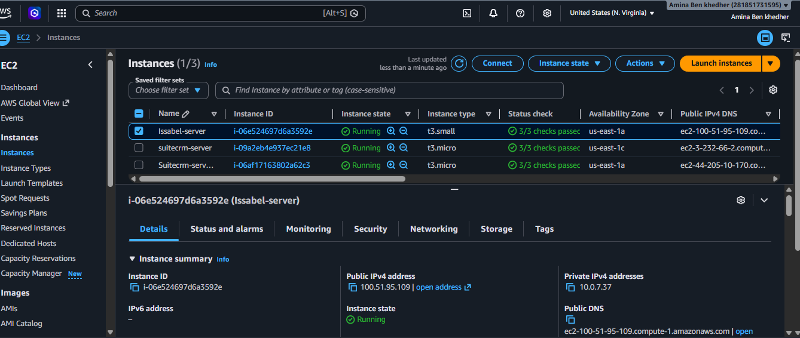

---

## Amazon VPC

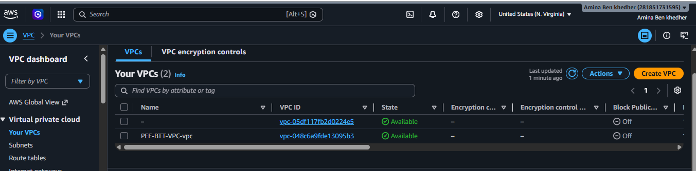

---

## Public Subnets

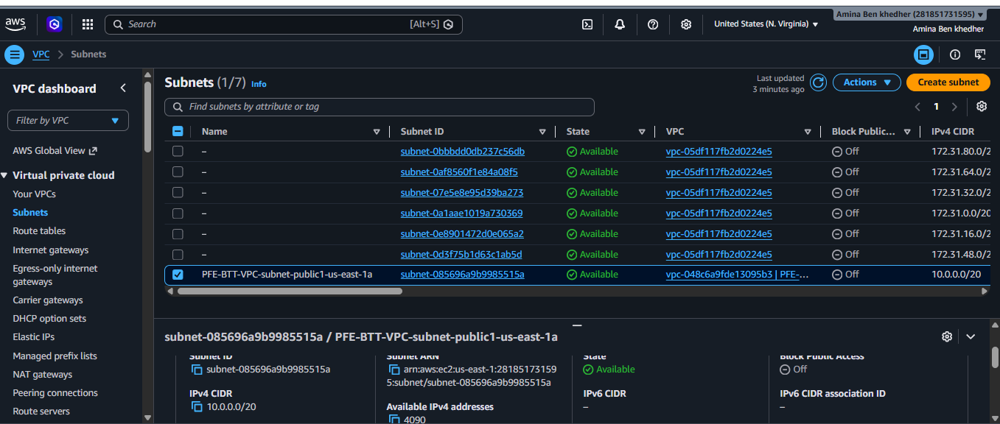

---

## Route Tables

---

## Internet Gateway

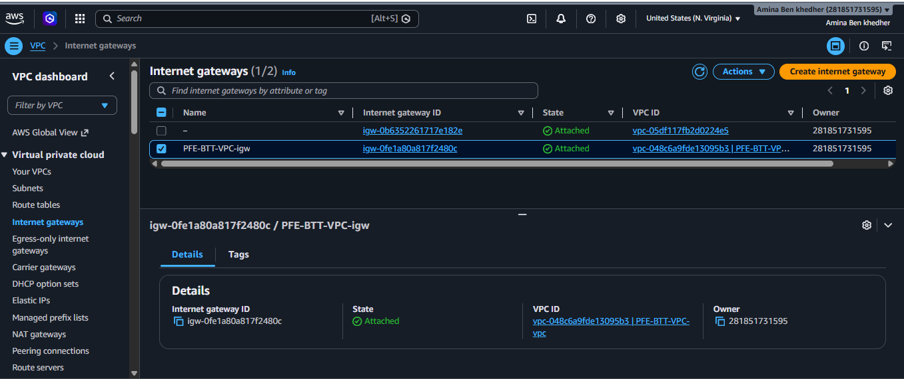

---

## Security Groups

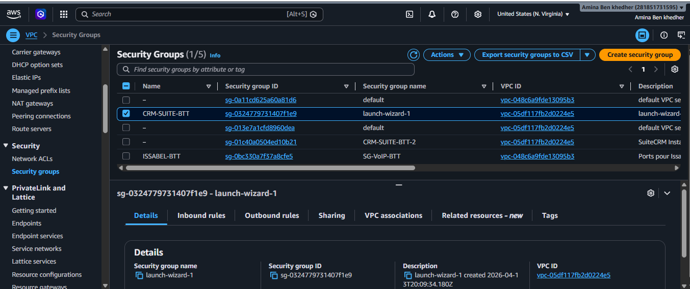

---

## Application Load Balancer

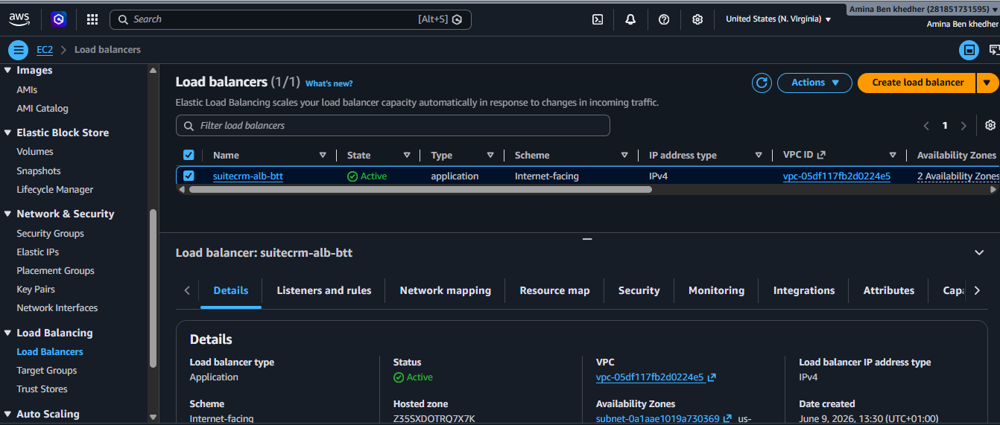

---

## Auto Scaling Group

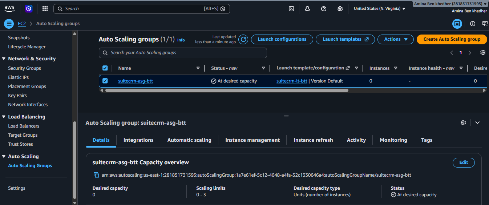

---

## Amazon RDS

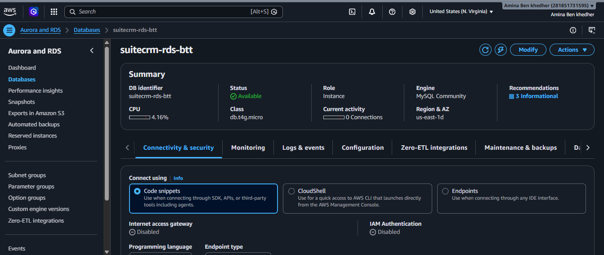

---

## Amazon S3

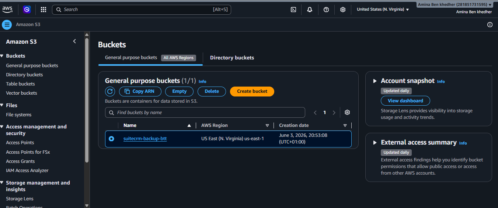

---

## Amazon CloudWatch

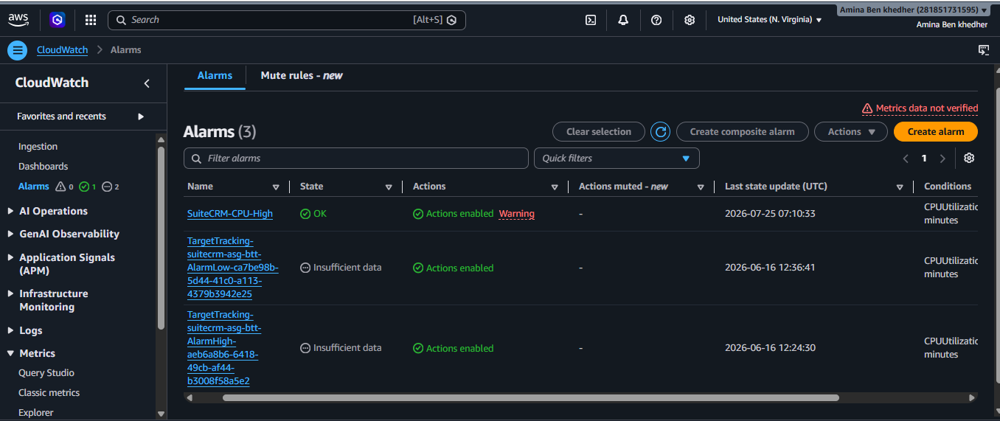

---

## IAM Users

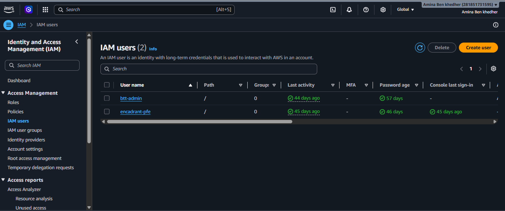

---

## IAM Roles

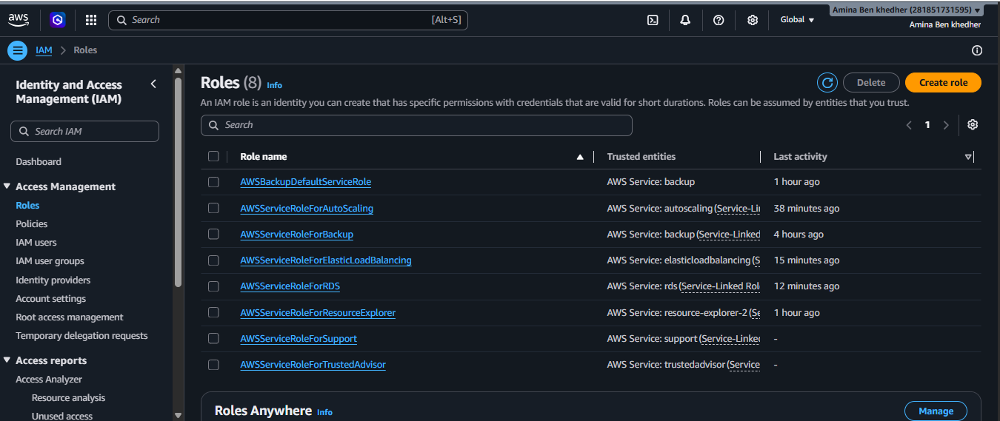

---

# 🚀 Future Improvements

Potential improvements include:

- Infrastructure as Code using Terraform
- CI/CD pipeline using GitHub Actions
- HTTPS using AWS Certificate Manager
- Amazon Route 53 integration
- AWS WAF implementation
- CloudTrail logging
- Multi-AZ deployment
- Private Subnets
- NAT Gateway
- Amazon SNS notifications

---

# 📚 Lessons Learned

This project allowed me to gain practical experience with:

- AWS Cloud Infrastructure
- Amazon EC2
- Amazon VPC
- Amazon RDS
- Amazon S3
- IAM
- Security Groups
- Route Tables
- Internet Gateway
- Load Balancing
- Auto Scaling
- Cloud Monitoring
- Backup Management
- Linux Server Administration
- Cloud Architecture Design

---

# 📌 Project Status

✅ Completed

Current version includes:

- Infrastructure deployment
- Monitoring
- Backup
- Networking
- Security
- Documentation

Future updates will include:

- Architecture Diagram
- Terraform Deployment
- CI/CD Pipeline
- Production Improvements

---

# 👩‍💻 Author

**Amina Ben Khedher**

**Aspiring AWS Cloud Engineer**

Master's Degree in Emerging Systems Engineering

AWS Academy Graduate – Cloud Foundations

---

⭐ If you found this project useful, feel free to star the repository.
